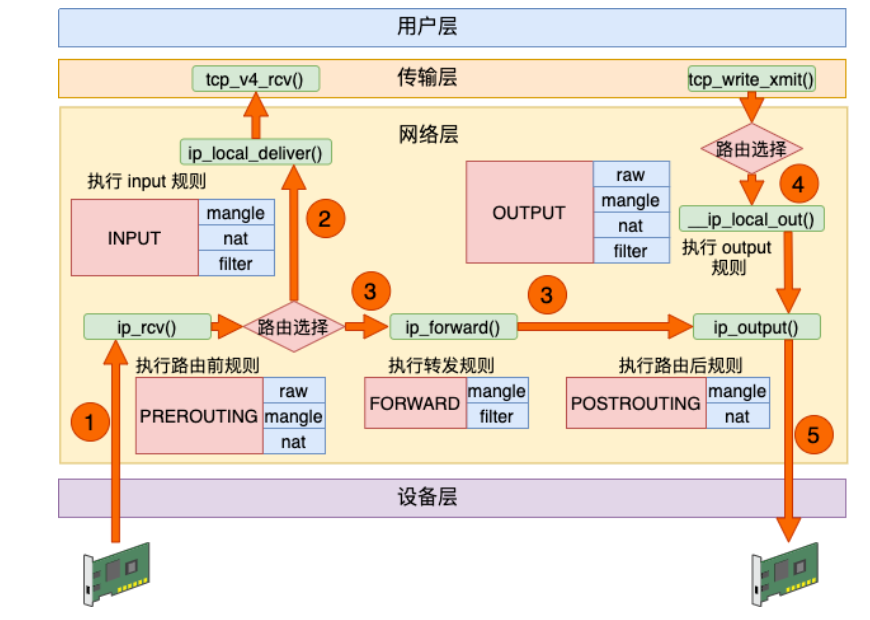
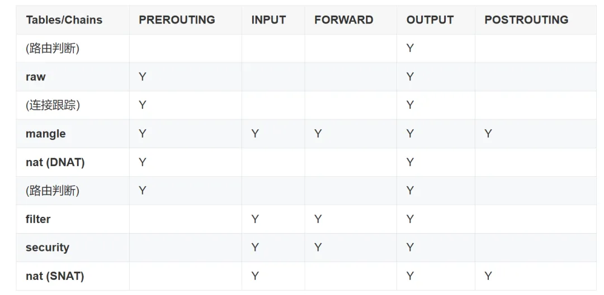
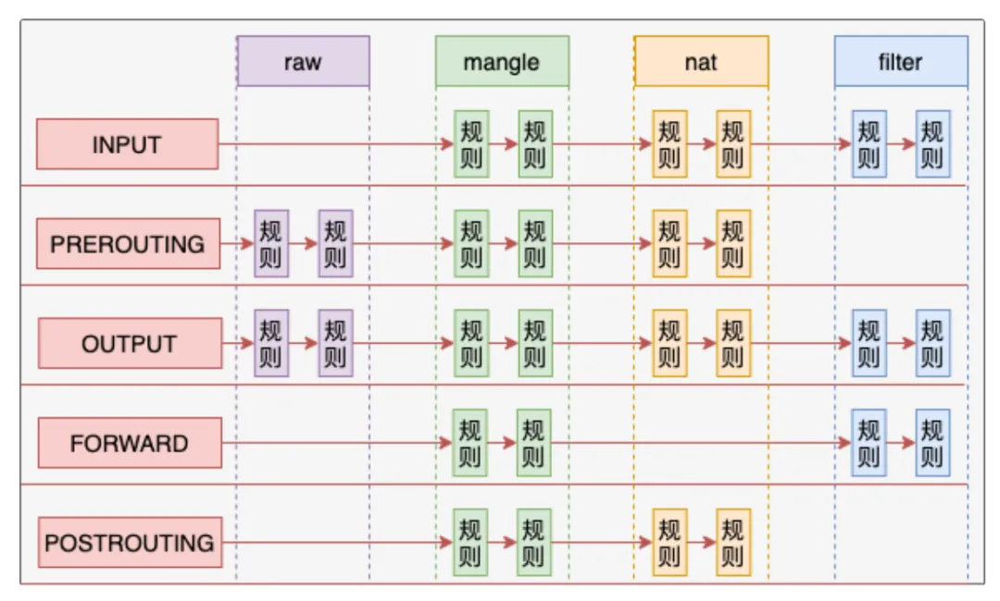
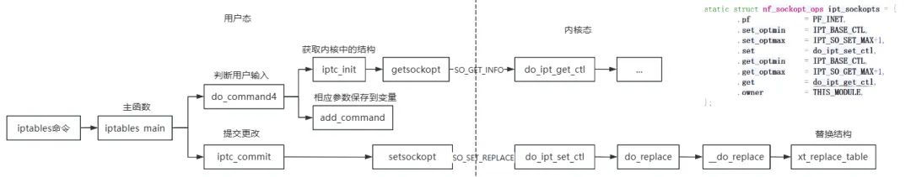

iptables 和 netfilter 学习笔记
=========================

Original 张铭轩 Linux内核之旅 _2024年10月15日 16:23_ _陕西_

作者简介：张铭轩，西安邮电大学计算机专业研二学生，导师陈莉君教授，热衷于探索linux内核。

#### **iptables和netfilter**

iptables是Linux 上最常用的防火墙工具，iptables 与协议栈内有包过滤功能的 hook 交互来完成工作。这些内核 hook 构成了 netfilter 框架

每个进入网络系统的包（接收或发送）在经过协议栈时都会触发这些 hook，程序可以通过**注册 hook 函数**的方式在一些关键路径上处理网络流量。iptables 相关的内核模块在这些 hook 点注册了处理函数，因此可以通过配置 iptables 规则来使得网络流量符合防火墙规则。

#### **netfilter框架**

netfilter 提供了 5 个 hook 点。包经过协议栈时会触发**内核模块注册在这里的处理函数** 。

其中主要包括：

*   `NF_IP_PRE_ROUTING`: 接收到的包进入协议栈后立即触发此 hook，在进行任何路由判断 （将包发往哪里）之前
    
*   `NF_IP_LOCAL_IN`: 接收到的包经过路由判断，如果目的是本机，将触发此 hook
    
*   `NF_IP_FORWARD`: 接收到的包经过路由判断，如果目的是其他机器，将触发此 hook
    
*   `NF_IP_LOCAL_OUT`: 本机产生的准备发送的包，在进入协议栈后立即触发此 hook
    
*   `NF_IP_POST_ROUTING`: 本机产生的准备发送的包或者转发的包，在经过路由判断之后， 将触发此 hook
    



以 `ip_rcv`为例，它主要负责接收和处理 IPv4 数据包，在处理完核心逻辑后，会进入内核预义的钩子进行后续处理。

```C
int ip_rcv(struct sk_buff *skb, struct net_device *dev, struct packet_type *pt,struct net_device *orig_dev)  
{  
 struct net *net = dev_net(dev);//返回与给定网络设备关联的net结构  
 //net结构用以表示内核中的网络命名空间  
 skb = ip_rcv_core(skb, net);  
 if (skb == NULL)  
  return NET_RX_DROP;  
  
 return NF_HOOK(NFPROTO_IPV4, NF_INET_PRE_ROUTING,  
         net, NULL, skb, dev, NULL,  
         ip_rcv_finish);  
}  
```

具体进入函数层面的分析：
```C
#define NF_HOOK(proto, hooknum, net, skb, dev, in, out) \  
    nf_hook(proto, hooknum, net, skb, dev, in, out)  
  
static inline int nf_hook(u_int8_t pf, unsigned int hook, struct net *net,struct sock *sk, struct sk_buff *skb,struct net_device *indev, struct net_device *outdev, int (*okfn)(struct net *, struct sock *, struct sk_buff *))  
{  
    struct nf_hook_entries *hook_head = NULL;  // 存储钩子链表的头指针  
    int ret = 1;  // 默认返回值  
 ...  
    // 根据协议族选择钩子链表  
    switch (pf) {  
    case NFPROTO_IPV4:  
        hook_head = rcu_dereference(net->nf.hooks_ipv4[hook]);    
        // 获取与当前网络命名空间相关的 IPv4 钩子链表  
        break;  
    ...  
    }  
    // 执行钩子处理  
    if (hook_head) {  
        struct nf_hook_state state;  
        // 初始化钩子状态  
        nf_hook_state_init(&state, hook, pf, indev, outdev, sk, net, okfn);  
        // 调用钩子处理函数  
        ret = nf_hook_slow(skb, &state, hook_head, 0);  
    }  
 ...  
    return ret;  // 返回处理结果  
}  
```

```c
//进入具体的处理函数  
int nf_hook_slow(struct sk_buff *skb, struct nf_hook_state *state,  
                 const struct nf_hook_entries *e, unsigned int s)  
{  
    unsigned int verdict;  
    int ret;  
  
    // 遍历所有钩子函数  
    for (; s < e->num_hook_entries; s++) {  
        // 调用当前钩子函数  
        verdict = nf_hook_entry_hookfn(&e->hooks[s], skb, state);  
  
        switch (verdict & NF_VERDICT_MASK) {  
        case NF_ACCEPT:  
            // 如果钩子返回接受，则继续下一个钩子  
            break;  
        case NF_DROP:  
            // 如果钩子返回丢弃  
            kfree_skb_reason(skb, SKB_DROP_REASON_NETFILTER_DROP);  
            ret = NF_DROP_GETERR(verdict);  
            if (ret == 0)  
                ret = -EPERM;  // 返回权限错误  
            return ret;  // 终止处理并返回丢弃结果  
        case NF_QUEUE:  
            // 如果钩子返回队列  
            ret = nf_queue(skb, state, s, verdict);  
            if (ret == 1)  
                continue;  // 继续下一个钩子  
            return ret;  // 返回处理结果  
        default:  
            // 对于 NF_STOLEN 或其他非标准结果的隐式处理  
            return 0;  
        }  
    }  
  
    return 1;  // 所有钩子处理完毕，返回接受结果  
}  
```

上述代码总结为，当 `NF_HOOK` 被调用时，Netfilter 会执行以下步骤：

1.  **查找钩子列表**：根据传入的协议和钩子点，Netfilter 查找已注册的钩子函数列表。
    
2.  **调用钩子函数**：遍历所有注册的钩子函数，依次调用每个钩子函数，并将数据包（`skb`）传递给它们。
    
3.  处理结果：每个钩子函数可以选择：

    *   继续处理数据包，返回 `NF_ACCEPT`。
    
    *   丢弃数据包，返回 `NF_DROP`。
    
    *   修改数据包并继续处理，返回 `NF_QUEUE` 或其他值。
    

#### **iptables 表和链**

iptables 使用 table 来组织规则，根据**用来做什么类型的判断**，将规则分为不同table。在每个 table 内部，规则被进一步组织成 chain，**内置的 chain 是由内置的 hook 触发 的**。chain 基本上能决定规则**何时**被匹配。内置的 chain 名字和 netfilter hook 名字是一一对应的：如`PREROUTING`是 由 `NF_IP_PRE_ROUTING` hook 触发的chain

因此不同 table 的 chain 最终都是注册到netfilter hook 。例如，有三个 table 有 `PRETOUTING` chain。当这些 chain 注册到对应的 `NF_IP_PRE_ROUTING` hook 点时，它们需要指定优先级，应该依次调用哪个 table 的 `PRETOUTING` chain，优先级从高到低。

#### **table种类**

**filter table：**

filter table 是最常用的 table 之一，用于**判断是否允许一个包通过**。

**nat table：**

nat table 用于实现网络地址转换规则。当包进入协议栈的时候，这些规则决定是否以及如何修改包的源/目的地址，以改变包被路由时的行为。`nat` table 通常用于将包路由到无法直接访问的网络。

**mangle table：**

mangle table 用于**修改包的 IP 头**。例如，可以修改包的 TTL，增加或减少包可以经过的跳数。这个 table 还可以对包打**只在内核内有效的**“标记”，后续的 table 或工具处理的时候可以用到这些标记。标记不会修改包本身，只是在包的内核表示上做标记。

**raw table：**

raw table 定义目的是使一个让包绕过连接跟踪。建立在 netfilter 之上的连接跟踪特性**使得 iptables 将包 看作已有的连接或会话的一部分**，而不是一个由独立、不相关的包组成的流。 数据包到达网络接口之后很快就会有连接跟踪逻辑判断。

**security table：**

security table 的作用是给包打上 SELinux 标记，以此影响 SELinux 或其他可以解读 SELinux 安全上下文的系统处理包的行为。这些标记可以基于单个包，也可以基于连接。

#### 每种 table 实现的 chain



**当一个包触发 netfilter hook 时，处理过程将沿着列从上向下执行**。其有内置的优先级，数值越小越优先。

```C
enum nf_ip_hook_priorities {  
 NF_IP_PRI_FIRST = INT_MIN,  
 NF_IP_PRI_RAW_BEFORE_DEFRAG = -450,  
 NF_IP_PRI_CONNTRACK_DEFRAG = -400,  
 NF_IP_PRI_RAW = -300,  //raw  
 NF_IP_PRI_SELINUX_FIRST = -225,  
 NF_IP_PRI_CONNTRACK = -200, //conntrack  
 NF_IP_PRI_MANGLE = -150, //manage  
 NF_IP_PRI_NAT_DST = -100, //dnat  
 NF_IP_PRI_FILTER = 0,  //filter  
 NF_IP_PRI_SECURITY = 50, //security  
 NF_IP_PRI_NAT_SRC = 100, //snat  
 NF_IP_PRI_SELINUX_LAST = 225,  
 NF_IP_PRI_CONNTRACK_HELPER = 300,  
 NF_IP_PRI_CONNTRACK_CONFIRM = INT_MAX,  
 NF_IP_PRI_LAST = INT_MAX,  
};  
```

特定事件会导致 table 的 chain 被跳过。例如，只有每个连接的第一个包会去匹配 NAT 规则，对这个包的动作会应用于此连接后面的所有包。到这个连接的应答包会被自动应用反方向的 NAT 规则。

对于不同的包，由于netfilter挂载函数的不同，导致其对应的chain也不同

*   收到的、目的是本机的包：`PRETOUTING` -> `INPUT`
    
*   收到的、目的是其他主机的包：`PRETOUTING` -> `FORWARD` -> `POSTROUTING`
    
*   本地产生的包：`OUTPUT` -> `POSTROUTING`
    

**综合前面讨论的 table 顺序问题，我们可以看到对于一个收到的、目的是本机的包**： 首先依次经过 `PRETOUTING` chain 上面的 raw、mangle、nat table；然后依次经 过 `INPUT` chain 的 mangle、filter、security、nat table，然后才会到达本机的某个 socket。



#### iptables 规则

规则放置在特定 table 的特定 chain 里面。当 chain 被调用的时候，包会依次匹配 chain 里面的规则。每条规则都有一个匹配部分和一个目标部分

规则的匹配部分指定了一些条件，包必须满足这些条件才会和相应的将要执行的动作进行关联。规则可以匹配**协议类型、目的或源地址、目的或源端口、目的或源网段、接收或发送的接口（网卡）、协议头、连接状态**等等条件。这些综合起来，能够组合成非常复杂的规则来区分不同的网络流量。

包符合某种规则的条件而触发的动作叫做目标。目标分为两种类型：

*   **终止目标**：这种 target 会终止 chain 的匹配，将控制权转移回 netfilter hook。根据返回值的不同，hook 或者将包丢弃，或者允许包进行下一 阶段的处理
    
*   **非终止目标**：非终止目标执行动作，然后继续 chain 的执行。虽然每个 chain 最终都会回到一个终止目标，但是在这之前，可以执行任意多个非终止目标
    

每个规则可以跳转到哪个 target 依上下文而定，例如，table 和 chain 可能会设置 target 可用或不可用。规则里激活的 extensions 和匹配条件也影响 target 的可用性。

还有一种特殊的非终止目标：跳转目标。jump target 是跳转到其他 chain 继续处理的动作。向用户自定义 chain 添加规则和向内置的 chain 添加规则的方式是相同的。不同的地方在于， **用户定义的 chain 只能通过从另一个规则跳转（jump）到它，因为它们没有注册到 netfilter hook**。用户定义的 chain 可以看作是对调用它的 chain 的扩展。

#### iptables 和 conntrack

在讨论 raw table 和 匹配连接状态的时候，我们介绍了构建在 netfilter 之上的连接跟踪系统。连接跟踪系统使得 iptables 基于连接上下文而不是单个包来做出规则判断， 给 iptables 提供了有状态操作的功能。

跟踪系统将包和已有的连接进行比较，如果包所属的连接已经存在就更新连接状态， 否则就创建一个新连接。如果 raw table 的某个 chain 对包标记为目标是 NOTRACK， 那这个包会跳过连接跟踪系统。

连接跟踪系统中的连接状态有：

*   `NEW`：如果到达的包关连不到任何已有的连接，但包是合法的，就为这个包创建一个新连接。对 面向连接的（connection-aware）的协议例如 TCP 以及非面向连接的（connectionless ）的协议例如 UDP 都适用
    
*   `ESTABLISHED`：当一个连接收到应答方向的合法包时，状态从 `NEW` 变成 `ESTABLISHED`。对 TCP 这个合法包其实就是 `SYN/ACK` 包；对 UDP 和 ICMP 是源和目 的 IP 与原包相反的包
    
*   `RELATED`：包不属于已有的连接，但是和已有的连接有一定关系。这可能是辅助连接（ helper connection），例如 FTP 数据传输连接，或者是其他协议试图建立连接时的 ICMP 应答包
    
*   `INVALID`：包不属于已有连接，并且因为某些原因不能用来创建一个新连接，例如无法 识别、无法路由等等
    
*   `UNTRACKED`：如果在 `raw` table 中标记为目标是 `UNTRACKED`，这个包将不会进入连 接跟踪系统
    
*   `SNAT`：包的源地址被 NAT 修改之后会进入的虚拟状态。连接跟踪系统据此在收到反向包时对地址做反向转换
    
*   `DNAT`：包的目的地址被 NAT 修改之后会进入的虚拟状态。连接跟踪系统据此在收到反向包时对地址做反向转换
    

#### iptable使用

iptables可以配置和管理 **Netfilter** 框架，其是一个用户态工具，用以定义网络数据包过滤规则，此处主要以NAT为例作为讲解

> ##### NAT
> 
> NAT是一种网络技术，用于在网络设备（如路由器、网关）上对数据包的源地址或目的地址进行修改，通常在局域网与互联网之间进行转换。NAT 主要用于节约 IPv4 地址，隐藏内部网络的结构，并在网络层提供一定程度的安全性。
> 
> NAT 在路由器或防火墙处修改通过的数据包的 IP 地址信息。常见的 NAT 类型包括：
> 
> 1.  **SNAT（Source NAT）**：修改数据包的源 IP 地址，通常用于内网设备访问外网时，将内网设备的私有 IP 地址替换为公共 IP 地址。
>     
> 2.  **DNAT（Destination NAT）**：修改数据包的目的 IP 地址，通常用于将外部请求映射到内网的某台服务器（如端口转发）。
>     
> 
> NAT 通过维护一个映射表，跟踪修改前后的 IP 地址和端口号，从而保证数据包能正确地返回给发起请求的内部设备。
> 
> **NAT 的类型**
> 
> 1.  **静态 NAT**：一个内部 IP 地址映射到一个固定的外部 IP 地址。通常用于让内部服务器暴露给外部网络。
>     
> 2.  **动态 NAT**：内部 IP 地址池映射到外部 IP 地址池。适用于内网设备临时需要与外网通信，使用的外部 IP 地址动态分配。
>     
> 3.  **PAT（端口地址转换）**，也叫**端口多路复用**：多个内部 IP 地址可以共享一个或多个外部 IP 地址，但通过不同的端口区分不同的连接。它是 NAT 中最常见的类型，也称为**NAT 重载**。
>     

和 NAT 相关的最重要的规则，都在 nat table 里。在相应chain中配置所需的规则，即可实现NAT的功能

iptables可以配置和管理 **Netfilter** 框架，定义网络数据包过滤规则

```bash
iptables [-t table] command [match pattern] [action]  
```

在指定好table和chain之后，需要对匹配模式进行指定

如

```bash
iptables -t nat -A POSTROUTING -p tcp -s 192.168.1.2 [...]
iptables -t nat -A POSTROUTING -p udp -d 192.168.1.2 [...]
iptables -t nat -A PREROUTING -s 192.168.0.0/16 -i eth0 [...]
```

至此，我们已经可以指定匹配模式来过滤包了，接下来就是选择合适的动作，对于 nat table，有如下几种动作SNAT, MASQUERADE, DNAT, REDIRECT，都需要通过 -j 指定

```bash
iptables [...] -j SNAT --to-source 123.123.123.123  
iptables [...] -j MASQUERADE  
iptables [...] -j DNAT --to-destination 123.123.123.123:22  
iptables [...] -j REDIRECT --to-ports 8080  
```

**SNAT**:修改源 IP 为固定新 IP,SNAT 只对离开路由器的包有意义，因此它只用在 `POSTROUTING` chain 中

**MASQUERADE**:修改源 IP 为动态新 IP,和 `SNAT` 类似，但是对每个包都会动态获取指定输出接口（网卡）的 IP

**DNAT** : 修改目的 IP

**REDIRECT** : 将包重定向到本机另一个端口

我们希望实现的是：**从本地网络发出的、目的是公网的包，将发送方地址修改为路由器 的地址。**

接下来假设路由器的本地网络走 `eth0` 端口，到公网的网络走 `eth1` 端口。那么**如下iptables命令就能完成我们期望的功能**：

```bash
iptables -t nat -A POSTROUTING -o eth1 -j MASQUERADE  
```

#### **注册钩子函数**

之后进入源码查看，一个钩子函数是怎么被注册的：

`nf_hook_ops`是 netfilter 框架中用于定义钩子操作的结构体

```C
struct nf_hook_ops {  
 nf_hookfn  *hook;//指向钩子函数的指针，钩子函数将在数据包通过特定钩子时被调用  
 struct net_device *dev;//指向特定网络设备的指针，表示该钩子操作适用的网络接口。  
 void   *priv;//指向用户自定义私有数据的指针，可以在钩子函数中使用，以便传递额外信息  
 u8   pf;//协议族，用于指定该钩子操作支持的协议  
 enum nf_hook_ops_type hook_ops_type:8;//钩子操作的类型，通常用于区分不同用途的钩子操作  
 unsigned int  hooknum;//钩子的位置，指示该钩子操作在 Netfilter 钩子链中的位置  
 int   priority;//钩子的优先级，值越小优先级越高  
};  
```

钩子函数的注册通常随着模块的加载，在模块初始化过程中通过直接或间接调用`nf_register_net_hooks`或`nf_register_net_hook`

依旧以nat为例，其hook点和相应信息被定义如下

```C
static const struct xt_table nf_nat_ipv4_table = {  
 .name  = "nat",  
 .valid_hooks = (1 << NF_INET_PRE_ROUTING) |  
     (1 << NF_INET_POST_ROUTING) |  
     (1 << NF_INET_LOCAL_OUT) |  
     (1 << NF_INET_LOCAL_IN),  
 .me  = THIS_MODULE,  
 .af  = NFPROTO_IPV4,  
};  
```

初始化 NAT 表时，调用`iptable_nat_init`进行注册

```C
module_init(iptable_nat_init);  
static int __init iptable_nat_init(void)  
{  
 int ret = xt_register_template(&nf_nat_ipv4_table,  
           iptable_nat_table_init);  
 ...  
}  
```

其关联到`iptable_nat_table_init`函数进行初始化

```C
static int iptable_nat_table_init(struct net *net)  
{  
    ...  
 repl = ipt_alloc_initial_table(&nf_nat_ipv4_table);//分配一个初始的NAT表结构  
 ...  
 ret = ipt_register_table(net, &nf_nat_ipv4_table, repl, NULL);//将表注册到netfilter框架中  
 ...  
    ret = ipt_nat_register_lookups(net);//注册NAT查找函数  
 ...  
}  
```

使用`ipt_register_table`进行注册

```C
int ipt_register_table(struct net *net, const struct xt_table *table,  
         const struct ipt_replace *repl,  
         const struct nf_hook_ops *template_ops)  
{  
 ...  
 ret = translate_table(net, newinfo, loc_cpu_entry, repl);//参数检查  
 ...  
 new_table = xt_register_table(net, table, &bootstrap, newinfo);//注册到netfilter框架中。  
 ...  
 ret = nf_register_net_hooks(net, ops, num_ops);//注册钩子操作  
    ...  
}  
```

`nf_register_net_hooks`调用`nf_register_net_hook`函数来创建钩子函数

```C
int nf_register_net_hook(struct net *net, const struct nf_hook_ops *reg)  
{  
 int err;  
  
 if (reg->pf == NFPROTO_INET) {//NFPROTO_INET协议族  
  if (reg->hooknum == NF_INET_INGRESS) {//chain为INGRESS  
   err = __nf_register_net_hook(net, NFPROTO_INET, reg);  
   if (err < 0)  
    return err;  
  } else {  
   err = __nf_register_net_hook(net, NFPROTO_IPV4, reg);//注册ipv4钩子  
   if (err < 0)  
    return err;  
  
   err = __nf_register_net_hook(net, NFPROTO_IPV6, reg);//注册ipv6钩子  
   ...  
  }  
 } else {  
  err = __nf_register_net_hook(net, reg->pf, reg);//注册钩子  
  if (err < 0)  
   return err;  
 }  
  
 return 0;  
}  
```

以ipv4钩子为例，进入`__nf_register_net_hook`函数

```C
static int __nf_register_net_hook(struct net *net, int pf,  
      const struct nf_hook_ops *reg)  
{  
 struct nf_hook_entries *p, *new_hooks;  
 struct nf_hook_entries __rcu **pp;  
 int err;  
  
 switch (pf) {  
 case NFPROTO_NETDEV:  
 ...  
 case NFPROTO_INET:  
  if (reg->hooknum != NF_INET_INGRESS)  
   break;  
  
  err = nf_ingress_check(net, reg, NF_INET_INGRESS);//检查  
  if (err < 0)  
   return err;  
  break;  
 }  
  
 pp = nf_hook_entry_head(net, pf, reg->hooknum, reg->dev);//获取指定钩子的头部指针  
 ...  
 p = nf_entry_dereference(*pp);  
 new_hooks = nf_hook_entries_grow(p, reg);//扩展钩子条目，以容纳新注册的钩子。  
 ...  
 nf_static_key_inc(reg, pf);//增加钩子的计数  
 ...  
 return 0;  
}  
```

其核心在`nf_hook_entries_grow`函数

```C
static struct nf_hook_entries *  
nf_hook_entries_grow(const struct nf_hook_entries *old,  
       const struct nf_hook_ops *reg)  
{  
 ...  
 new = allocate_hook_entries_size(alloc_entries);//分配新的钩子条目空间  
 new_ops = nf_hook_entries_get_hook_ops(new);// 获取新分配的钩子的操作指针  
    //插入新钩子  
 while (i < old_entries) {//遍历旧钩子  
        //比较优先级  
        //如果新的钩子优先级低，将原始钩子保留在新列表  
  if (inserted || reg->priority > orig_ops[i]->priority) {  
   new_ops[nhooks] = (void *)orig_ops[i];  
   new->hooks[nhooks] = old->hooks[i];  
   i++;  
  } else {//如果新的钩子优先级高，插入新钩子  
   new_ops[nhooks] = (void *)reg;  
   new->hooks[nhooks].hook = reg->hook;  
   new->hooks[nhooks].priv = reg->priv;  
   inserted = true;  
  }  
  nhooks++;  
 }  
 //未找到 即新插入的钩子优先级最低  
 if (!inserted) {//在末尾插入  
  new_ops[nhooks] = (void *)reg;  
  new->hooks[nhooks].hook = reg->hook;  
  new->hooks[nhooks].priv = reg->priv;  
 }  
  
 return new;  
}  
```

至此，将相应的的钩子插入到netfilter框架之中。

#### iptables调用逻辑

iptables的具体实现逻辑如下图所示



在 `iptables` 中，从用户态添加一个规则到内核态的流程如下：

**用户态调用**：

*   用户通过 iptables 命令行工具调用添加规则的命令：
    
*   该命令被解析，并调用相应的库函数（通常是 `libiptc` 中的函数）。
    

**准备规则**：

*   在用户空间，命令行工具会构造规则结构体，并将规则信息填充到这个结构体中。
    

**调用 libiptc**：

*   用户态工具调用 `libiptc` 中的函数，例如 `iptc_append_entry`，来将规则添加到指定的链中。
    
*   `libiptc` 会使用套接字（通常是原始套接字）与内核通信。
    

**套接字通信**：

*   `libiptc` 使用 `socket` 系统调用创建一个原始套接字，并使用 `getsockopt` 或 `setsockopt` 来发送规则。
    
*   具体而言，会调用 `TC_INIT` 来初始化句柄，并通过 `getsockopt` 获取当前规则的信息。
    

**进入内核态**：

*   当调用 `setsockopt` 发送规则时，控制权转移到内核态。内核中的 `netfilter` 处理逻辑会处理这个请求。
    

**处理规则**：

*   内核中的 `netfilter` 接收这个请求，并将规则添加到相应的链中。具体实现位于 `net/netfilter` 目录下。
    
*   内核会更新相应的数据结构（如 `ip_tables`）。
    

**返回结果**：

*   添加规则后，内核会将结果返回给用户态程序，通常通过返回值或设置 `errno` 的方式。
    

**用户态接收结果**：

*   用户态工具接收内核的返回结果，并打印成功或错误信息给用户。
    

具体流程再次不进行叙述，主要核心逻辑在于`xt_replace_table`

```C
struct xt_table_info *xt_replace_table(struct xt_table *table,  
       unsigned int num_counters,  
       struct xt_table_info *newinfo,  
       int *error)  
{  
    struct xt_table_info *private;  
 ...  
    //将旧表的初始条目复制到新信息中  
 newinfo->initial_entries = private->initial_entries;  
      
 table->private = newinfo;  
 ...  
}  
```

源码环境为6.2.0

## ref
[1] [iptables 和 netfilter 学习笔记](https://mp.weixin.qq.com/s/xDFEpEGnonl9RUUwQMkxOw)