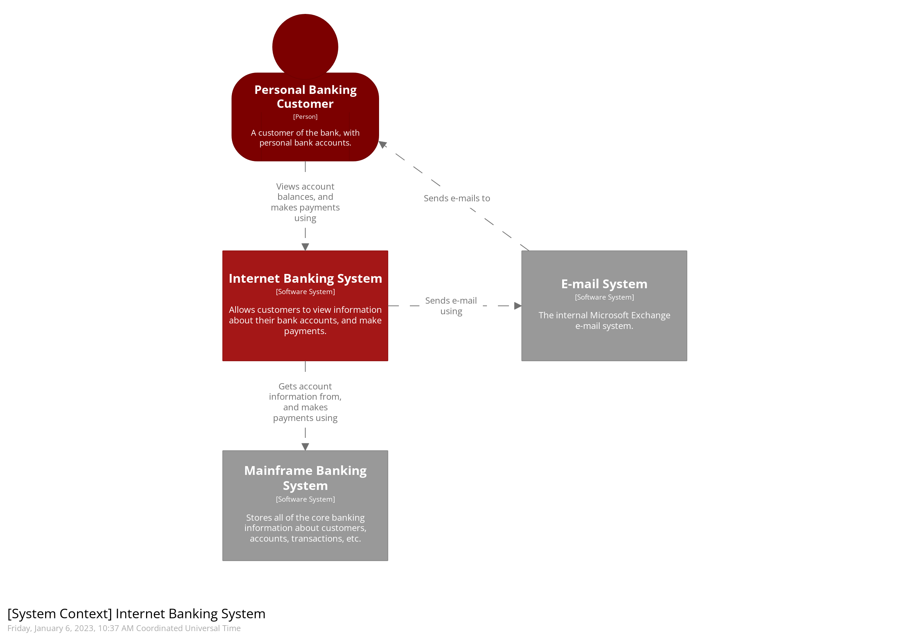
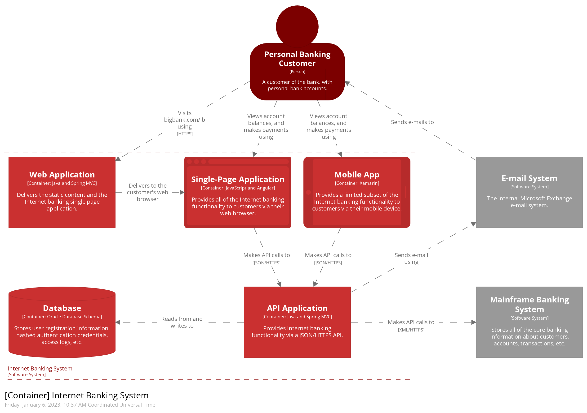
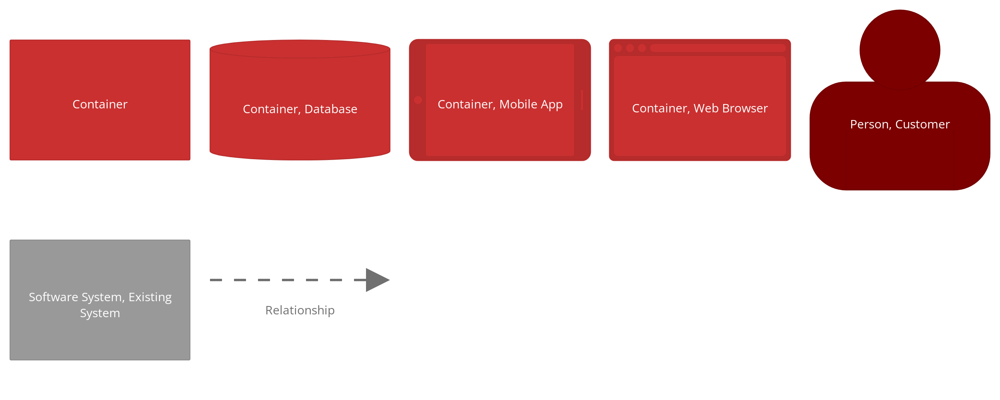
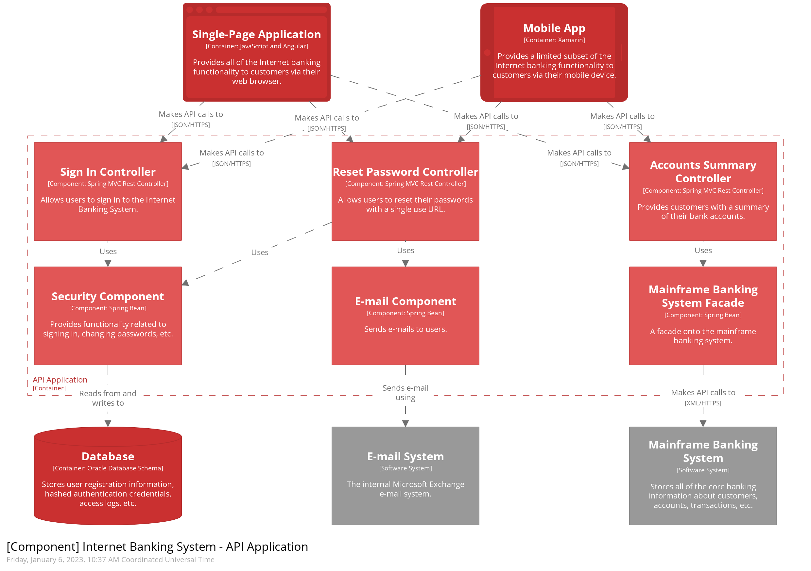
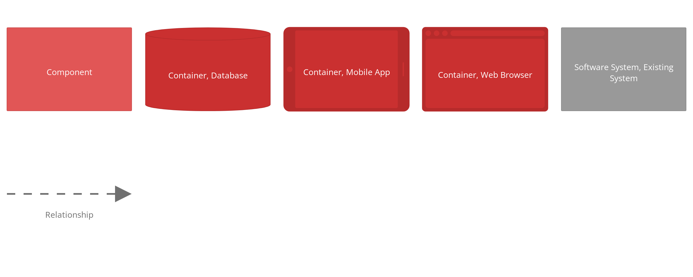
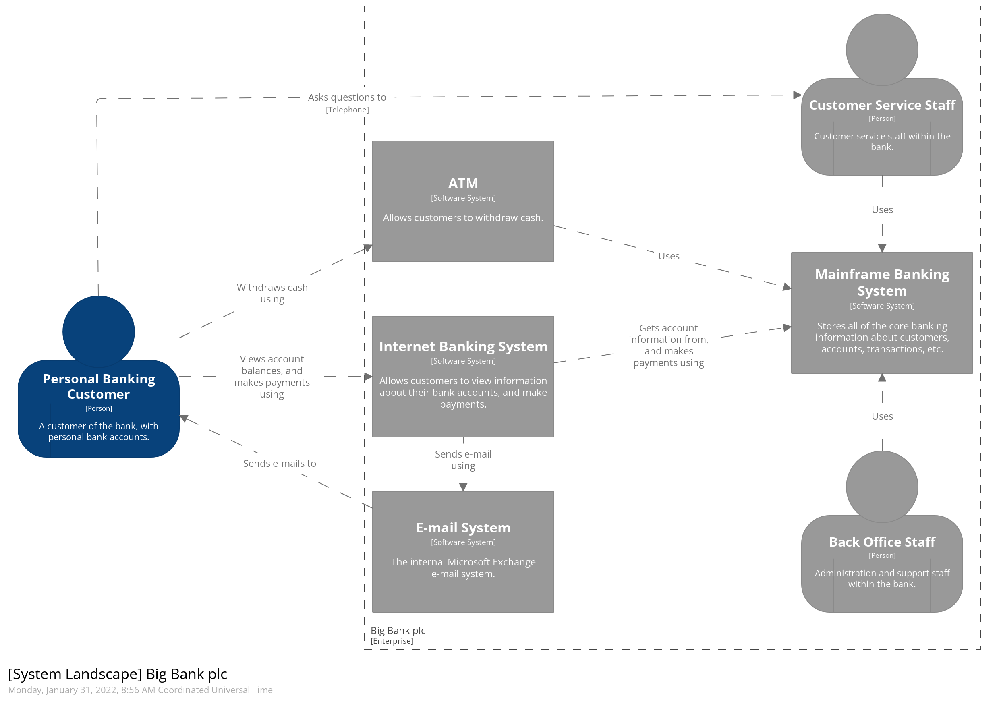
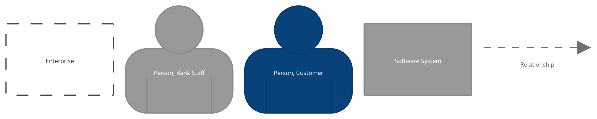
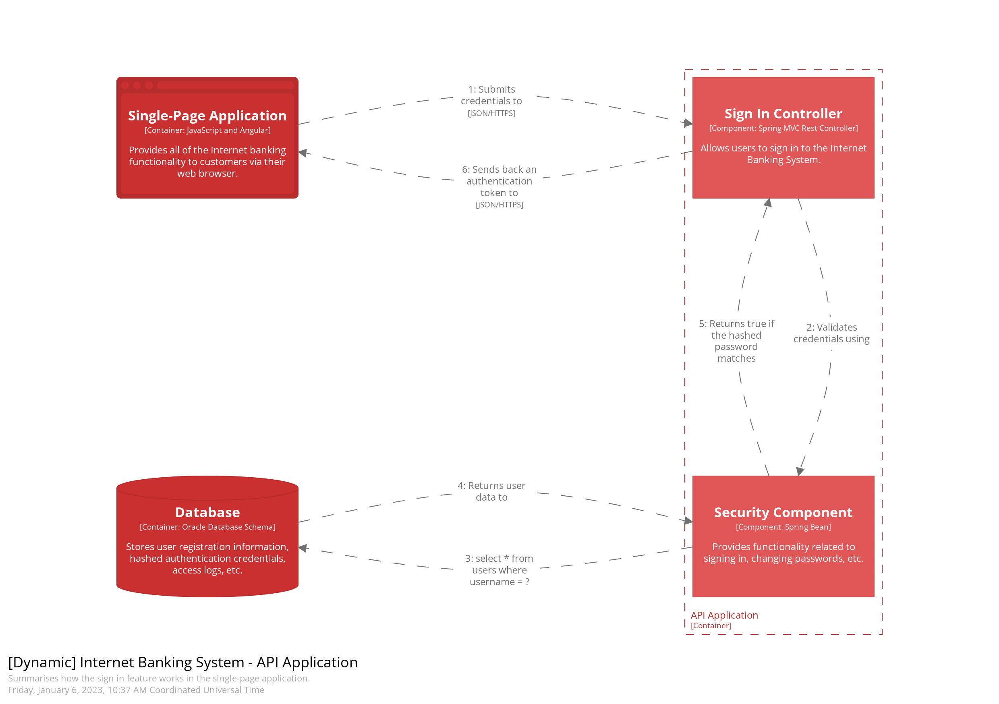
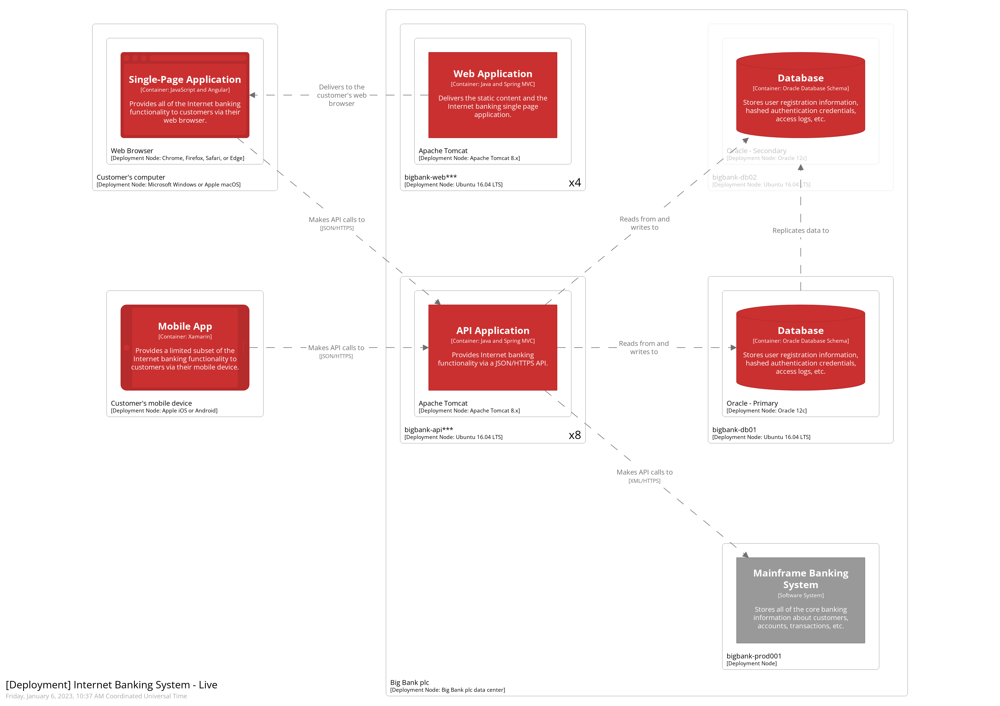
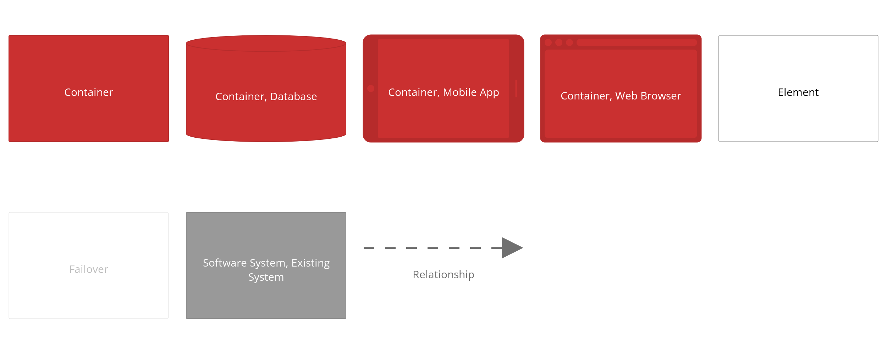

# C4 model

## 引言
    C4模型是一种软件架构图的表达方式，主要针对架构师和开发人员。是一种分层表达方式，由粗到细的过程表示。


## 概念
    为了创建这些代码映射，我们首先需要一套通用的抽象概念来创建一种无处不在的语言，我们可以用它来描述软件系统的静态结构。C4模型以容器、组件和代码的方式考虑软件系统的静态结构。而人们使用的是我们构建的软件系统。


    一个软件系统是由一个或多个容器（网络应用、移动应用、桌面应用、数据库、文件系统等）组成的，每个容器都包含一个或多个组件，而这些组件又是由一个或多个代码元素（如类、接口、对象、函数等）来实现。

### 人
```
角色
```

### 软件系统
```
软件系统是最高级别的抽象，它描述的是为用户提供价值的东西，无论他们是否是人类。这包括你正在建模的软件系统，以及你的软件系统所依赖的其他软件系统（反之亦然）。在许多情况下，一个软件系统是由一个软件开发团队 "拥有 "的。
```

### 容器
```
非Docker,C4模型中容器代表应用程序或数据存储。容器是为了使整个软件系统工作而需要运行的东西。
容器本质上是一个上下文或边界，其中一些代码被执行或一些数据被存储。而每个容器是一个单独的可部署/可运行的东西或运行时环境，通常（但不总是）在它自己的进程空间中运行。正因为如此，容器之间的通信通常采取进程间通信的形式。
```

### 组件
    在软件开发行业中，"组件 "这个词是一个严重超载的术语，但在这里，组件是被封装在一个明确定义的接口后面的相关功能的组合。如果你使用的是像Java或C#这样的语言，对组件最简单的理解就是，它是一个接口后面的实现类的集合。至于这些组件是如何打包的（例如，每个JAR文件、DLL、共享库中的一个组件与多个组件）是一个独立的、正交的问题。
    这里需要注意的一点是，一个容器中的所有组件通常在同一个进程空间中执行。在C4模型中，<p>组件不是可单独部署的单元</p>。

## 核心图
```
通过创建上下文、容器、组件和（可选）代码（例如 UML 类）图的集合来可视化这种抽象层次结构。这就是 C4 模型得名的地方。
```

### 第一层: 系统上下文
```
系统上下文图是绘制和记录软件系统的一个很好的起点，可以让你退一步看清全局。画一张图，把你的系统作为一个盒子放在中心，周围是它的用户和与之交互的其他系统。
细节在这里并不重要，因为这是你的放大图，显示了系统景观的大画面。重点应该放在人（演员、角色、人物等）和软件系统上，而不是技术、协议和其他低级别的细节。这是你可以给非技术人员看的那种图。

范围： 一个单一的软件系统

主要元素: 范围内的软件系统
支持要素: 与范围内的软件系统直接相连的人、软件系统。

目标受众： 每个人，包括技术和非技术人员。
```



### 第二层： 容器
```
一旦了解了系统如何适应整个IT环境，接下来的一个非常有用的步骤就是使用容器图放大系统边界。“容器”类似于服务器端Web应用程序，单页应用程序，桌面应用程序，移动应用程序，数据库架构，文件系统等。本质上，容器是可单独运行/可部署的单元（例如，单独的进程空间） ）执行代码或存储数据。
容器图显示了软件体系结构的高层结构以及如何在其间分配职责。它还显示了主要的技术选择以及容器之间的通信方式。这是一个简单的，专注于技术的高级图表，对软件开发人员和支持/运营人员均非常有用。

范围: 一个单一的软件系统。

主要元素: 范围内的软件系统的容器。
支持要素: 与容器直接相连的人和软件系统。

目标受众: 软件开发团队内部和外部的技术人员；包括软件架构师、开发人员和运营/支持人员。

备注: 下图没有提到部署方案、集群、复制、故障转移等。
```



### 第三层： 组件
```
接下来，您可以放大并进一步分解每个容器，以识别主要的结构构件及其相互作用。
组件图显示了容器是如何由多个“组件”组成的，这些组件分别是什么，它们的职责以及技术/实现细节。

范围: 一个单一的容器。

主要元素: 在范围内的容器内的组件。
支持要素: 容器（在范围内的软件系统内）加上与组件直接相连的人和软件系统。

受众: 软件架构师和开发人员。
```



### 第四层： 代码（可选）
```
最后，您可以放大每个组件以显示如何将其实现为代码。使用UML类图，实体关系图或类似的图。
这是可选的详细级别，通常可以从IDE等工具中按需获得。理想情况下，此图将使用工具（例如，IDE或UML建模工具）自动生成，并且您应该考虑仅显示那些允许您讲述自己想要讲述的故事的属性和方法。除了最重要或最复杂的组件外，不建议使用此级别的细节。

范围： 一个单一组件。

主要元素： 组件范围内的代码元素（如类、接口、对象、函数、数据库表等）。

受众： 软件架构师和开发人员。
```


## 补充图


### 系统全景图
```
C4模型提供单个软件系统的静态视图，但是在现实世界中，软件系统永远不会孤立存在。因此，尤其是在您负责一组软件系统时，了解所有这些软件系统如何在企业范围内融合在一起通常很有用。为此，只需添加另一个C4图顶部的图，以从IT角度显示系统格局。像系统上下文图一样，该图可以显示组织边界，内部/外部用户和内部/外部系统。
本质上，这是企业级软件系统的高级映射，其中每个感兴趣的软件系统都有C4向下钻取。从实践的角度来看，系统格局图实际上只是系统上下文图，而没有特别关注特定的软件系统。

适用范围：企业。

主要元素：范围内与企业相关的人员和软件系统。

目标受众：软件开发团队内外的技术人员和非技术人员。
```



### 动态图
```
当您想显示静态模型中的元素如何在运行时进行协作以实现用户故事，用例，功能等时，动态图可能会很有用。该动态图基于UML通讯图 （以前称为“ UML”协作图”）。它类似于UML序列图， 但是它允许带有编号的交互作用的图元素的自由形式排列以指示顺序。

动态图 ≈ 通信图 + 时序图

范围：企业、软件系统或容器。

主要元素和支持元素：取决于图表范围； 企业（参见系统景观图）、软件系统（参见系统上下文或容器图）、容器（参见组件图）。

目标受众：软件开发团队内外的技术人员和非技术人员。
```



### 部署图
```
部署图使您能够说明静态模型中的容器如何映射到基础结构。该部署图基于UML部署图，尽管略微简化以显示容器和部署节点之间的映射。部署节点类似于物理基础架构（例如物理服务器或设备），虚拟化基础架构（例如IaaS，PaaS，虚拟机），容器化基础架构（例如Docker容器），执行环境（例如数据库服务器，Java EE） Web /应用程序服务器，Microsoft IIS）等。部署节点可以嵌套。
您可能还希望包括基础结构节点，例如DNS服务，负载平衡器，防火墙等。

范围：一个或多个软件系统。

主要元素：部署节点、软件系统实例和容器实例。
支持元素：用于部署软件系统的基础设施节点。

目标受众：软件开发团队内外的技术人员； 包括软件架构师、开发人员、基础架构架构师和运营/支持人员。
```



## REF
* [c4model](https://c4model.com/)
* [用于软件架构的 C4 模型](https://www.infoq.cn/article/c4-architecture-model)
* [DDD：C4 model](http://apframework.com/2020/03/19/ddd-C4/)